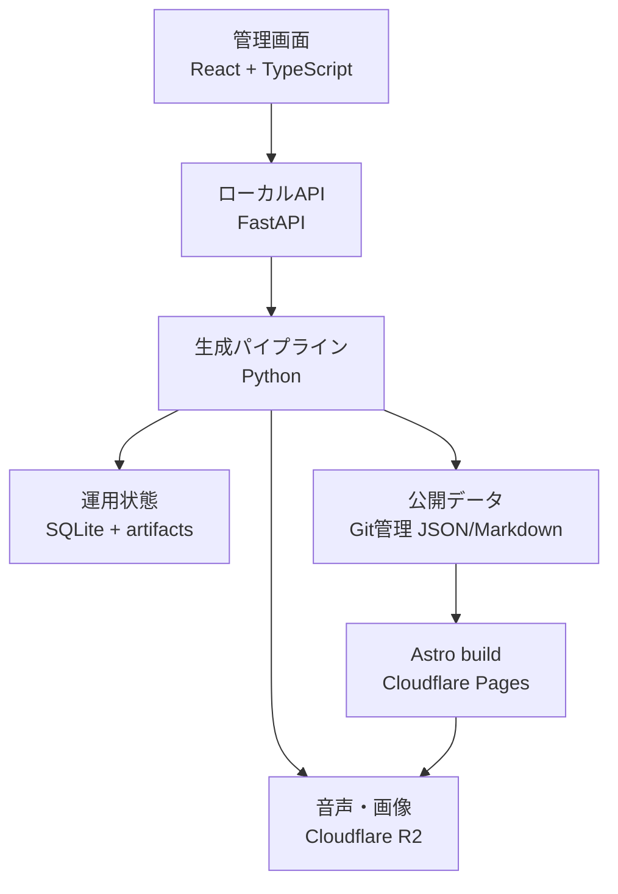

# development-plan.md — history-radio 開発計画（フェーズ別タスク・検証コマンドの正本）

全体像・アーキテクチャ・技術選定の要約は [PLAN.md](../../PLAN.md) を参照。本書は
仕様書 [history_radio_spec_v0_4.md](../../history_radio_spec_v0_4.md)（以下「仕様書」）を
実装可能な単位へ分解し、採用言語、構成、品質基準、検証方法まで確定する。

> 基本方針: 見た目は簡素でよい。ただし、公開サイトと管理画面は機能を削らず、
> 「静的配信」「強い型」「小さな実行時依存」「失敗時に安全側へ倒れる設計」で、堅牢性と速度を優先する。

AGENTS.md §4 の方針（小タスク＋各タスクの検証コマンド）に従う。フェーズを跨ぐ大きな
`feat:` コミットには、本書の該当タスクへの差分を同一コミットに含める
（`feat-without-plan` hard 検査 — `.guardrails/GUARDRAILS.md` §3.4）。

---

## 1. 技術選定（確定）

### 1.1 言語と責務

| 領域              | 採用技術                                     | 用途                                                 | 採用理由                                  |
| --------------- | ---------------------------------------- | -------------------------------------------------- | ------------------------------------- |
| 生成パイプライン        | **Python 3.14.x**                        | 収集、権利判定、選出、OpenRouter、VOICEVOX、FFmpeg、関連書籍検索、公開ゲート | HTTP・データ処理・外部CLI連携の実装が速く、ライブラリが成熟している |
| ローカル管理API       | **Python / FastAPI**                     | ジョブ操作、レビュー、承認、設定、監査ログ、SSE進捗通知                      | パイプラインの型と処理を共有でき、別サービス間の重複を減らせる       |
| 公開サイト           | **TypeScript 7.0.x / Astro 7**           | エピソード、出典、訂正履歴、検索、RSS案内                             | HTMLを静的生成し、通常ページはJavaScriptなしでも表示できる  |
| 管理画面            | **TypeScript 7.0.x / React 19 + Vite 8** | 候補審査、主張‐出典対応、台本差分、音声・スライド確認、再実行                    | 状態の多いUIを型安全に組み立てやすく、テスト資産が豊富          |
| Cloudflare上の小処理 | **TypeScript / Workers**                 | 将来のリダイレクト、非公開プレビュー、Webhookのみ                       | Cloudflareで第一級にサポートされる。MVPの通常配信には使わない |
| 検索              | **Pagefind**                             | 公開済みページの全文検索                                       | 静的HTMLから検索索引を作るため、検索サーバーとDBが不要        |
| 永続化             | **SQLite（WAL）+ Git + R2**                | ローカル運用状態、公開データ、音声・画像                               | 用途ごとに責務を分離し、単一障害点を作らない                |

Pythonだけで管理画面まで作らない。逆に、クローラーやメディア生成をNode.jsへ寄せない。
この2言語構成は役割の境界が明確で、どちらか一方へ無理に統一するより実装量と障害範囲を抑えられる。

Rustは初期採用しない。処理時間の大半はネットワーク待ち、LLM待ち、VOICEVOX、FFmpegであり、
まず計測してPython自体がボトルネックと確認できた箇所だけ、後から置換を検討する。

参考:

* [Python公式ダウンロード](https://www.python.org/downloads/)
* [Astro 7の公式案内](https://astro.build/blog/whats-new-june-2026/)
* [Cloudflare PagesのAstroガイド](https://developers.cloudflare.com/pages/framework-guides/deploy-an-astro-site/)
* [Cloudflare WorkersのTypeScript対応](https://developers.cloudflare.com/workers/languages/typescript/)
* [TypeScript公式サイト](https://www.typescriptlang.org/)
* [Reactの公式バージョン情報](https://react.dev/versions)
* [Pagefind公式ドキュメント](https://pagefind.app/docs/)

### 1.2 バージョン固定

* Pythonは `requires-python = ">=3.14,<3.15"` とし、`uv.lock` をコミットする。
* Node.jsは **24 LTS** を `.node-version` とCIで固定する。
* TypeScriptは7.0.x、Astroは7.x、Reactは19.2.x、Viteは8.xを採用し、正確なpatch版を
  `package.json` と `pnpm-lock.yaml` で固定する。`latest` 指定を本番ビルドへ持ち込まない。
* pnpmは11系を使い、`packageManager` フィールドで正確なバージョンを固定する。
* VOICEVOX、FFmpegはPython依存へ混ぜず、外部実行ファイルとしてバージョン、取得元、SHA-256を記録する。
* 依存更新は自動マージしない。週1回の更新PRで、全テストとプレビューを通してから取り込む。

### 1.3 Pythonの標準構成

* パッケージ管理・実行: `uv`
* モデルと入力検証: Pydantic v2
* HTTP: HTTPX。`AsyncClient` を再利用し、接続プール、ドメイン別同時実行数、タイムアウトを明示する
* DB: SQLAlchemy 2 + Alembic。SQLiteはWAL、`busy_timeout`、単一writer、短いトランザクションを原則とする
* CLI: Typer
* ローカルAPI: FastAPI。`127.0.0.1` のみにbindし、外部公開しない
* ログ: JSON構造化ログ。`job_id`、`episode_id`、`source_id` を必須コンテキストにする
* 品質: Ruff（lint/format）、basedpyright（strict）、pytest、coverage

業務ロジックで `Any`、無検査の `dict[str, object]`、巨大な例外握りつぶしを常用しない。
FastAPIのroute関数へ権利判定や公開判定を書かず、domain/use-case層を呼ぶだけにする。

`asyncio` はクロールなどI/O待ちにだけ使う。CPU処理を無条件に非同期化しない。
FFmpeg、VOICEVOXのプロセスには必ずタイムアウト、終了コード検査、キャンセル時の子プロセス終了を実装する。

### 1.4 TypeScriptの標準構成

* パッケージ管理: pnpm workspace
* 型検査: TypeScript `strict` に加え、`noUncheckedIndexedAccess`、
  `exactOptionalPropertyTypes`、`useUnknownInCatchVariables` を有効化する
* lint/format: Biome。型検査は `tsc --noEmit` を別実行する
* 単体テスト: Vitest
* ブラウザテスト: Playwright
* アクセシビリティ検査: axe-core
* 公開サイト: Astroの静的出力。クライアントJavaScriptは検索、音声プレイヤー、絞り込みなど
  操作が必要な部品だけ遅延読み込みする
* 管理画面: React。コンポーネントライブラリを丸ごと導入せず、ネイティブHTMLと小さな共通部品を優先する
* CSS: 通常CSS + CSS Custom Properties。見た目の都合だけで重いCSSフレームワークを導入しない

アプリケーションコードは `.ts` / `.tsx` を原則とし、手書きの `.js` はビルド設定など
必要最小限に限定する。`as any`、型検査を迂回する二重cast、API応答の無検証利用をCIで禁止する。

公開サイトでReact Server Components、SSR、常時稼働APIを使わない。公開ページの表示に
Workers、D1、ローカルPCのいずれも必要としない構成にする。

---

## 2. システム構成



### 2.1 保存先の責務

| データ                | 正本                    | 備考                                 |
| ------------------ | --------------------- | ---------------------------------- |
| ソース登録・権利規則・モデル設定   | Git                   | 人がレビューでき、変更履歴が残る形式にする              |
| 取得本文・スナップショット      | ローカル `artifacts/`     | 保存許可がある資料だけ。公開リポジトリへ入れない           |
| ジョブ、候補、レビュー状態、監査ログ | SQLite                | 日次バックアップ対象。公開サイトの表示には使わない          |
| 公開エピソード、主張、出典、訂正履歴 | Git上の版管理JSON/Markdown | Astroのビルド入力。GitHubから再構築できる         |
| MP3、スライド画像、MP4     | R2                    | SHA-256付きの不変キー。公開データ側から参照する        |
| 公開HTML、検索索引、RSS    | Cloudflare Pages      | GitHub ActionsまたはPages buildで再生成可能 |

公開済み情報をすべてローカルだけに保持する必要はない。ただし、公開前の取得本文、審査情報、
トークン、未公開原稿をGitHubへ置かない。Gitには公開に必要な最小データと設定だけを入れる。

### 2.2 リポジトリ構成

```text
.
├─ apps/
│  ├─ site/                 # Astro公開サイト
│  └─ admin/                # Reactローカル管理画面
├─ services/
│  └─ pipeline/
│     ├─ src/history_radio/
│     │  ├─ domain/         # 副作用のない型・規則
│     │  ├─ rights/         # 権利判定
│     │  ├─ ingest/         # 収集アダプター
│     │  ├─ select/         # 機械選出
│     │  ├─ llm/            # OpenRouter境界
│     │  ├─ script/         # 台本
│     │  ├─ media/          # VOICEVOX・FFmpeg
│     │  ├─ books/          # 関連書籍
│     │  ├─ publish/        # 公開データ生成
│     │  ├─ distribute/     # RSS・配信先
│     │  ├─ gate/           # 公開検査
│     │  ├─ store/          # DB・ファイル実装
│     │  └─ api/            # localhost FastAPI
│     └─ tests/
├─ packages/
│  ├─ contracts/            # JSON Schemaと生成済みTypeScript型
│  └─ ui/                   # 最小限の共通UI部品・デザイントークン
├─ content/episodes/        # 公開エピソードの版管理データ
├─ config/                  # ソース・権利・モデル設定
├─ migrations/              # Alembic
├─ scripts/                 # dev、検証、バックアップ
├─ artifacts/               # ローカル生成物。Git対象外
└─ .github/workflows/
```

依存方向は `domain ← rights/select ← use-cases ← adapters` とし、`domain` からHTTP、DB、
OpenRouter、Cloudflareを参照しない。ソースごとの差はアダプターへ閉じ込める。

### 2.3 PythonとTypeScriptの契約

* Pydanticモデルからバージョン付きJSON Schemaを生成し、`packages/contracts/schema/` へコミットする。
* TypeScript型はSchemaから自動生成し、手書きで二重管理しない。
* CIで「Schemaを再生成して差分0」を検査する。
* すべての公開データに `schema_version`、`episode_id`、`revision`、`generated_at` を持たせる。
* 破壊的変更は新しい `schema_version` と移行コードを必要とする。
* APIは `/api/v1/` を使い、更新時は `revision` またはETagによる楽観ロックで上書き競合を防ぐ。

---

## 3. Web要件

### 3.1 公開サイト（簡素な見た目、豊富な機能）

必須機能:

* エピソード一覧、年代・地域・人物・テーマによる絞り込み
* Pagefindによる日本語全文検索。検索UIと索引は検索開始時に遅延読み込み
* 音声プレイヤー（再生速度、10秒送り/戻し、章移動、キーボード操作、再生位置の端末内保存）
* 台本の表示、章単位コピー、全文コピー、Markdown/プレーンテキストのダウンロード
* 各主張から、その根拠となる出典へ展開できる「主張‐出典対応表」
* 出典名、原URL、取得日、ライセンス、権利判定、クレジットの表示
* 訂正履歴と過去版の閲覧。現行版と旧版の差分表示
* 関連書籍、Podcast RSS、YouTubeへの導線
* 共有用OGP、canonical URL、構造化データ、サイトマップ
* 404でも検索、一覧、RSSへ戻れる導線

公開ページには保存した根拠抜粋を無条件に掲載しない。公開許可のある引用だけを表示し、
それ以外は主張、出典メタデータ、原URLの表示に留める。

### 3.2 ローカル管理画面

必須画面:

1. **ダッシュボード**: 今日のジョブ、失敗、待機、API使用量、R2/Git同期状態
2. **候補一覧**: 点数内訳、除外理由、ニュース連想リスク、重複、採否の一括操作
3. **出典・権利審査**: 利用規約スナップショット、ライセンス根拠、判定履歴、手動保留
4. **主張台帳**: 主張と独立した出典系統の対応、根拠位置、不足出典の警告
5. **台本レビュー**: 版差分、claim_id、禁止表現、転載類似箇所、承認/差戻し
6. **メディア確認**: 音声、字幕、スライド、クレジット、動画の同期プレビュー
7. **ジョブ管理**: 実行、停止、安全な再実行、失敗地点からの再開、ログ表示
8. **設定**: ソース、ライセンス、モデル、禁止語の編集。変更前後の差分と監査記録
9. **公開確認**: URL、RSS、R2、ハッシュ、過去版、公開ゲートの最終一覧

ジョブ進捗はWebSocketではなくSSEを基本とする。操作は通常のHTTP APIとし、再接続しやすくする。
一覧APIは件数が増えても全件返さず、カーソルページング、絞り込み、並べ替えを備える。
MVPは単一運用者を想定し、管理APIをインターネットへ公開しない。

### 3.3 速度・アクセシビリティ予算

* 公開エピソードページは静的HTMLを返し、JavaScript無効でも本文、出典、訂正履歴を読めること
* 初回表示に不要な音声、検索索引、差分表示コードを読み込まないこと
* エピソードページの初期JavaScriptはgzip後 **60 KB以下**を目標とし、超過時はCIで警告する
* Lighthouse目標: Performance 90以上、Accessibility 95以上、Best Practices 95以上
* Core Web Vitals目標: LCP 2.5秒未満、CLS 0.1未満、INP 200ms未満
* 画像は表示寸法を明示し、AVIF/WebPを生成する。OGP等で必要な場合だけPNG/JPEGを残す
* キーボード操作、フォーカス表示、十分なコントラスト、`prefers-reduced-motion` を必須にする
* 大きな台本、出典一覧、検索結果は仮想化または段階表示し、DOMを無制限に増やさない

### 3.4 堅牢性・セキュリティ

* Cloudflare Pagesの静的配信を通常経路とし、Workers/D1障害で既存ページが読めなくなる設計を禁止する
* メディアを先にR2へ配置・ハッシュ検証し、その後に公開データをGitへ反映する
* 公開は「検証済み成果物への参照切替」とし、途中状態を見せない。直前版へロールバック可能にする
* Markdown/HTMLは許可リストでsanitizeし、ソース由来のHTMLをそのまま描画しない
* CSP、`X-Content-Type-Options`、`Referrer-Policy`、`Permissions-Policy` をPagesのヘッダーに設定する
* 管理APIはlocalhost限定。将来外部公開する場合はCloudflare Access、CSRF対策、権限分離を別フェーズで設計する
* OpenRouter、R2、Google Driveの資格情報をGit、SQLite、ログへ保存しない
* すべての外部HTTPに接続・読み取り・全体タイムアウト、再試行上限、指数バックオフを設定する
* 書き込み処理には冪等キーを使い、二重実行で二重公開・二重アップロードしない
* 失敗時の既定動作は `blocked` または `manual_review`。不明状態を公開可へ倒さない

---

## 4. フェーズ構成

仕様書 §6（処理フロー7工程）、§16（MVP範囲）、§17（受入条件の段階制）に対応させる。
各フェーズは公開しない状態で単体検証できる単位とし、状態機械
`collected → screened → selected → scripted → rendered → approved → published` と整合させる。

進捗の一覧・機械可読タスクは [PLAN.md](../../PLAN.md) を参照。

### Phase 0 — モノレポと開発基盤 ✅

* [x] `bindings/catalog.md` のPython/uv列とTypeScript/Node/pnpm列を採用し、実在する列IDを記録する。
  検証: `scripts/repo_scan.py` が未刻印・未配線をHARDで検出できる。
* [x] Python 3.14、Node 24 LTS、pnpm workspace、`uv.lock`、`pnpm-lock.yaml` を初期化する。
  検証: `uv run python --version`、`node --version`、`pnpm --version` が固定範囲内。
* [x] `apps/site`、`apps/admin`、`services/pipeline`、`packages/contracts` を上記構成で作る。
  検証: 各パッケージの空ビルドとimportが通る。
* [x] `scripts/dev.py` に `check`、`test`、`build`、`up`/`reset`/`db` を配線する。
  検証: WindowsとCIの両方で同じコマンドが動く。
* [x] Ruff、basedpyright、pytest、Biome、`tsc -b`、Vitest、PlaywrightをCIへ登録する。
  検証: 意図的なlint違反と型違反をPython/TypeScript各1件ずつ入れ、CIが失敗する
  （`tsc --noEmit`単体だとproject-references構成で何も検査しない実測バグを発見・`tsc -b`へ修正）。

### Phase 1 — ドメイン契約・状態機械・保存基盤 ✅

* [x] `SourceRecord`、`RightsDecision`、`Candidate`、`Claim`、`Episode`、`Job`、`AuditEvent` を
  Pydanticで定義し、JSON SchemaとTypeScript型を生成する。
  検証: 必須項目欠落・未知のschema_versionをPythonが拒否する（56テスト）。TypeScript側は
  型生成まで(json-schema-to-typescript)——ランタイム検証(ajv等)はTS側で実際にJSONを
  受け取る消費者ができてから追加する(Phase 8以降のAPI層)。
* [x] 状態遷移をpure functionで定義し、不正な逆行と段階飛ばしを拒否する。
  検証: 全9前進辺・代表的な失敗遷移・8つの禁止遷移を表駆動テストで固定。
* [x] SQLite、Alembic、WAL、`busy_timeout`、単一writerを実装する。
  検証: 2つの読取中にwriterが更新でき、競合更新がrevision不一致(EpisodeConflictError)で拒否される。
* [x] `config/source_registry.yaml`、`license_rules.yaml`、`model_registry.yaml` をSchema検証する。
  検証: 未知キー、重複ID、不正URL、期限切れ・有料モデル設定を起動時に拒否する(8テスト)。

### Phase 2 — Webの土台を先に作る ✅（年代・地域・人物フィルタは未実装 — 下記参照）

* [x] `apps/site` にエピソード一覧、詳細、出典、訂正履歴、404をfixtureで実装する。
  検証: ビルド後のHTMLから直接fixture文言を検索し、JavaScript無しで内容が読めることを確認。
* [x] Pagefindをbuild後処理へ組み込み、日本語全文検索を実装する。
  検証: fixtureの固有語(「アペール」)で検索し、該当エピソードが返る(Playwright 2件)。
  **未実装**: 年代・地域・人物の絞り込みフィルタ——現時点でfixtureのメタデータに
  年代/地域/人物の構造化フィールドが無く、Pagefindのfilter機能を使う対象が無い。
  Phase 5(出典独立性・題材選出)でtopicsに年代/人物等の構造化データが載ったら追加する。
* [x] 音声プレイヤー、章移動、再生速度、再生位置保存を遅延読み込み部品として実装する。
  検証: Playwrightでキーボードのみの再生・停止・章移動・前後10秒送りが通る(3件)。
* [x] `apps/admin` とlocalhost FastAPIをfixtureで接続し、ダッシュボード、候補、ジョブ画面を作る。
  検証: API停止・タイムアウト・空データ・壊れた応答の6ケースをvitestで固定。
* [x] CSP、セキュリティヘッダー、axe、性能予算をCIへ追加する。
  検証: axe(wcag2a/aa)で4ページとも重大違反0件。gzip後60KB予算をビルドの一部として
  検査(`pnpm --filter apps-site run build`に組み込み済みでCI/pre-pushが自動網羅)。
  **Lighthouseではなく数値予算(§3.3のgzip 60KB)を直接測る方式を採用**——LighthouseのCI上の
  性能スコアはCPU割当でばらつきやすく決定的でないため(判断ごと記録)。

### Phase 3 — 権利判定エンジン（仕様書 §5A・§5.2）

事実収集より先に判定器を完成させる。権利不明資料を本文保存や公開処理へ流さない。

* [x] 権利表示文字列を `normalized_license_id` へ正規化する。
  検証: `cc0`、`cc-by`、`cc-by-sa`、`gov-jp-2.0`、`unknown` のnamedテスト
  （`services/pipeline/src/history_radio/rights/license_normalization.py`）。
* [x] §5Aの判定項目（没年計算、映画1953年、写真1957年、戦時加算等）をpure functionで実装する。
  **年数は資料取得ごとに現在日付で再計算する**。
  検証: 各規則の許可最小ケース、境界、拒否ケースをnamedテストで固定する
  （`services/pipeline/src/history_radio/rights/screening.py`）。年代計算だけで満了と
  分かった資料も、専門家レビューで個別に解禁されるまでは `rights/engine.py` 側で
  `manual_review` に留める（§5A冒頭の方針どおり、Phase 3時点では解禁経路は未実装）。
* [x] 判定不能、入力不足、規約取得失敗を `manual_review` または `deny` へ倒す。
  検証: 欠損値を組み合わせても `allow_public_use` にならない
  （`services/pipeline/src/history_radio/rights/engine.py`）。
* [x] 判定入力、規則バージョン、結果、理由を追記型の監査ログへ残す。
  検証: 同じ資料を新ルールで再判定しても旧判定が消えない
  （`services/pipeline/src/history_radio/store/rights.py` — `rights_records` は
  `decision_id` を主キーとする追記のみのテーブルとし、更新・削除関数を持たせない
  ことで構造的に保証する。保存のたびに `audit_events` へも記録する）。

### Phase 4 — 収集（仕様書 §7・§5.3）

MVP対象はWikipedia、Wikimedia Commons、NDLデジタルコレクションの利用可能区分、ColBase、
および明示的に許可したCC0資料とする。

* [x] 共通取得結果スキーマとアダプターProtocolを実装する。
  検証: 必須フィールド欠落を型検査と実行時検証で拒否する
  （`ingest/schema.py`・`ingest/adapter.py`。storage/publication権限の分離と
  保存許可なしfull_textの実行時拒否を含む）。
* [x] ソースごとに独立アダプターを実装する。APIを優先し、robots.txt、規約、レート制限に従う。
  検証: 記録済みfixtureを用いた統合テストを実ネットワークなしで通す
  （`ingest/adapters/` — Wikipedia・Wikimedia Commons（ファイル単位ライセンスの
  資料単位判定）・NDLデジタルコレクション（「インターネット公開（保護期間満了）」
  区分のみ収集し他区分は例外で拒否）・ColBase（規約ベースCC BY相当）。
  実APIの応答形は2026-07時点の記録fixtureが正——形が変わればパース例外で
  fail closedに止まる。ライセンス正規化へ `ndl-internet-pd` を追加し、
  §5A冒頭の明示列挙に基づき自動採用対象へ組み入れた — config/license_rules.yaml）。
* [x] ドメイン別セマフォ、接続プール、タイムアウト、条件付きGET、指数バックオフを実装する。
  検証: 429、5xx、タイムアウト、途中切断を注入し、上限後に安全に停止する
  （`ingest/crawl_control.py`。Retry-After遵守・過大レスポンス拒否・Clock注入込み）。
* [x] `status: approved` のソースだけを収集し、権利判定を通過しない本文を保存しない。
  検証: `candidate` と `internal_research_only` の全文が永続化されない
  （`ingest/collector.py` — candidateは取得自体を行わず、判定はPhase 3エンジンで
  取得のたびに再計算して追記保存。`store/documents.py` は store_full_text=False で
  受け取った本文を捨てるfail-closed経路）。
* [x] 取得URL、取得日時、レスポンスハッシュ、規約スナップショット、出典関係を保存する。
  検証: 同じ内容の再取得で重複スナップショットを作らない
  （`store/documents.py` — fetch_snapshots/terms_snapshotsともcontent_hashで重複抑制）。

### Phase 5 — 出典独立性・題材選出（仕様書 §6.2・§6A）

* [x] 出典の系統判定（転載、同一一次資料由来、同一組織系列等）を実装する。
  検証: 仕様書の独立性パターンをnamedテストで固定する
  （`select/lineage.py` — §6.2の4パターンをunion-findの併合規則に写した純粋関数。
  一次＋独自二次が2系統を保つケースも固定）。
* [x] §6A.1の候補点計算式をLLM不使用で実装し、点数内訳を保存する。
  検証: 各特徴量を固定した入力から期待点数が得られる
  （`select/scoring.py` — 全特徴量1で45点の初期式・重み注入・範囲外は例外で拒否。
  内訳合計＝候補点の性質も固定）。
* [x] ニュースから使う語は題材選出用に限定し、本文・要約を歴史エピソードの出典にしない。
  検証: ニュースURLが公開出典一覧へ混入しない
  （`select/news_filter.py` — 採用結果 `NewsDerivedTerms` はURLフィールド自体を
  持たないfrozenモデル。混入経路が型レベルで存在しない）。
* [x] 悪感情を呼ぶニュースとの便乗連想を避けるため、死傷、災害、戦争、事件、差別、疾病、
  性犯罪等のカテゴリと禁止語で候補を隔離する。曖昧な場合は採用せず手動確認へ送る。
  検証: 代表的な不適切連想ケースが自動採用されない
  （災害×交通の連想・禁止語1件での全語不採用・カテゴリ/イベント型不明のfail closed・
  個人名の不採用をnamedテストで固定。禁止語辞書はPhase 11で管理画面と併せてconfig化）。
* [x] 類似題材、同一人物、同一事件のクールダウン期間を実装する。
  検証: 期間内の重複候補が順位から除外される
  （`select/cooldown.py` — 境界日込みの除外・期間経過後の解除・順序維持フィルタ）。

### Phase 6 — LLM処理・主張台帳・台本（仕様書 §8・§9）

* [x] OpenRouterの固定モデルをレジストリで管理し、価格、利用可否、構造化出力、日本語回帰を検査する。
  ランダムルーターを本番へ使わない。
  検証: 無料枠外、期限切れ、回帰失敗モデルを採用しない
  （`store/config_loader.load_model_registry` — openrouter/free・/auto等の
  ランダムルーター拒否・構造化出力非対応拒否・日本語回帰未合格拒否をnamedテストで固定。
  実OpenRouter接続の配線はAPIキー到着後 — HUMAN_TASKS.md）。
* [x] 要約、facts、根拠位置をJSON Schemaで受け取る。URL、取得日、ライセンスはプログラムから注入する。
  検証: JSON不正、余分なキー、存在しない根拠位置を拒否する
  （`llm/extraction.py` — §8.2スキーマはextra=forbidで、URL等のフィールド自体を
  持たない。出所は `attach_provenance` が資料レコードから注入する）。
* [x] 根拠抜粋が保存本文と完全一致することをプログラムで検証する。
  検証: 1文字改変した抜粋が拒否される
  （`verify_evidence_quote` — locator位置の部分文字列と完全一致のみ許可。
  保存本文の無い資料の引用も拒否）。
* [x] `claim_ledger` を作り、独立系統2件未満の主張を台本へ入れない。
  検証: 1系統だけの主張が `allowed_in_script: false` になる
  （`llm/ledger.py` — 系統IDの重複は集合で数え、単一系統は qualification=資料帰属を
  強制する — §6.2）。
* [x] §9.1の7段構成で台本を生成し、各外部検証可能文を `claim_id` へ結びつける。
  検証: claim_idのない事実文、台帳にない事実、禁止表現を含む台本を拒否する
  （`script/schema.py`＋`script/validator.py` — 7段の欠落・順序違反も拒否し、
  問題は全件列挙で報告。**生成側のLLM呼び出し配線はOpenRouterクライアント実装時**
  ——検証器が先にあることで、生成が繋がった日から公開検査が効く）。
* [x] 生成結果、プロンプト版、モデルID、入力ハッシュ、出力ハッシュ、使用量を保存する。
  検証: 同じ入力と版ではキャッシュが使われ、二重課金呼び出しをしない
  （`llm/cache.py` — キャッシュキーは (model_id, prompt_version, input_hash)。
  版またはモデルが変われば再実行。実呼び出しはcaller注入でフェイク検証済み）。

### Phase 7 — 音声・スライド動画・関連書籍（仕様書 §10・§10A）

読み辞書（人名・地名・元号・官職）の設計・出典・ライセンス方針、および実装タスクの
詳細な分解は本書 §8（特に §8.4）が正本。VOICEVOXのナレーション品質は読み仮名の
正確さに直結する（仕様書§9.2「読み上げ困難な固有名詞には読み仮名を付ける」）ため、
**§8.4の全タスクを本フェーズの音声生成タスクより前に完了させる**（7ソースの取得
アダプタ・手動修正辞書・解決器・VOICEVOXへの読み適用までを含み、想定より工数が
大きい——1タスクとして見積もらない）。

* [x] VOICEVOX（ずんだもん）の起動確認、音声生成、クレジット自動付与を実装する。
  検証: エンジン停止、タイムアウト、途中失敗で不完全MP3を公開対象にしない
  （`media/voicevox.py` — `VoicevoxClient`。speaker=3〔ずんだもん・ノーマル〕。
  `check_version`でエンジン起動確認、`synthesize`はaudio_query→synthesisの
  2段階すべてで例外を握りつぶさず、非200・空応答・タイムアウトを`VoicevoxError`
  へ。`CREDIT_TEXT="VOICEVOX:ずんだもん"`定数を公開ページ・概要欄・音声末尾で
  共通利用する契約——実際の埋め込み先〔publish/gate層〕はPhase 8以降）。
* [x] FFmpegで音量正規化、無音、破損、長さ、codecを検査する。
  検証: 基準外音量と破損音声を公開ゲートが拒否する
  （`media/ffmpeg_audio.py` — ローカル導入済みのffmpeg/ffprobeへ実際に問い合わせる
  統合テスト。`validate_audio`は問題を全件列挙し、無音・基準外音量・破損・
  長さ不足・非許可codecをすべて検査する。子プロセスは全てタイムアウト付き）。
* [x] 静止画、地図、年表、字幕からスライド動画を生成する。素材不足時は自作図形へフォールバックする。
  検証: 画像0件でも権利上安全な動画を生成できる
  （`media/slides.py` — 台本の7段構成から1スライドずつ決定する純粋関数
  〔題名・60字以内の本文行・8〜20秒の表示秒数・出典番号〕。使える素材が無い
  セクションは`uses_self_drawn_fallback=True`のスライドを必ず生成し、
  スライドが0件になったり生成が止まったりしない。`media/slide_render.py`が
  Pillowで実際にPNGを描画〔自作フォールバックは単色背景のテキストカード〕し、
  FFmpegで静止画列＋音声をMP4へ結合する。日本語フォントが1つも見つからない
  環境ではフォールバックせず`SlideRenderError`で止める（文字化けを黙って
  許容しない）。地図・年表・比較図の高度な自動生成〔Natural Earth・地理院タイル
  連携〕は将来の拡張として残し、本タスクは「画像0件でも安全に動画化できる」
  ことの充足を優先した——テストは実際のffmpeg/ffprobe/Pillow/日本語フォントに
  対する統合テスト）。
* [x] 画像の権利、クレジット、使用箇所を `media_manifest` に記録する。
  検証: クレジット欠落素材をレンダリング前に拒否する
  （`media/media_manifest.py` — `MediaAsset`〔licensed/self_drawn〕。クレジット
  空文字・licensed素材の出典URL/正規化ライセンスID欠落・asset_id重複を全件
  列挙して拒否。自作図形も著作権が発生しないだけでクレジット自体は必須のまま）。
* [x] ISBN、著者、件名標目による関連書籍検索と機械ランキングを実装する。LLMは使わない。
  検証: 書誌系統1件だけの候補を非表示にする
  （`books/search.py` — §10Aの初期式（題名35+件名25+人物20+時代10+新しさ5+
  音声版5）。独立した書誌システムが2件未満の候補・題名だけの曖昧一致・
  閾値未満の候補を除外〔埋め合わせをせず空リストで「関連書籍なし」を表す〕。
  ISBN/Amazon商品識別子の確認可否でアフィリエイトリンク可否を分離）。

### Phase 8 — 公開ページ統合・Cloudflare（仕様書 §10B・§10C）

* [x] Pythonからバージョン付き公開JSON/Markdownを生成し、Astroのcontent collectionで検証する。
  検証: 不正Schema、欠落出典、未知ライセンスでbuildを失敗させる。
  実装メモ: `services/pipeline/src/history_radio/publish/episode_page.py`。
  `EpisodePageData`（Pydantic）は`apps/site/src/content.config.ts`のzodスキーマと
  フィールド1対1対応（camelCaseへは`render_episode_frontmatter`が変換）。
  `validate_episode_page()`が生成時点で拒否する3点: episode_id形式、
  `normalized_license_id`が`rights.engine.AUTO_APPROVABLE_LICENSE_IDS`外の出典、
  claimsの`source_indexes`範囲外参照——全問題を一括報告するfail closed設計
  （script/validator.py等と同じ house style）。検証(validate)と描画(render)を
  分離（resolver.py/slides.pyと同じ「決定と実行の分離」）。
  Python生成→実際に`pnpm --filter apps-site run build`で受理されることを
  手動生成した検証用episodeで実地確認済み（二重の網の両層を実証、検証後は
  scratchとして削除）。単体テストは`tests/publish/test_episode_page.py`(22件)。
* [ ] `/episodes/<ID>/` と `/episodes/<ID>/versions/<revision>/` を生成する。
  検証: 再生成が旧版を上書きせず、新版と訂正履歴を追加する。
* [ ] 主張‐出典対応、コピー、ダウンロード、過去版差分を実データへ接続する。
  検証: 全公開主張から1件以上の有効な出典URLへ到達できる。
* [ ] R2へハッシュ付きキーでmediaをアップロードし、存在・サイズ・ハッシュを確認する。
  検証: 同じ入力の再実行が重複オブジェクトを作らない。
* [ ] Cloudflare Pagesへ独自ドメイン、HTTPS、キャッシュ、セキュリティヘッダー、404を設定する。
  検証: プレビューと本番でリンク切れ、mixed content、ヘッダー欠落が0件。
* [ ] Pages/R2からGit上の直前版へ戻す手順を自動化する。
  検証: ステージングで1回ロールバックし、URLとRSS GUIDが変わらない。

### Phase 9 — RSS・配信先（仕様書 §10D）

* [ ] RSS 2.0を静的生成し、GUID、公開日時、enclosure、長さ、MIME、クレジットを固定する。
  検証: 標準バリデーターでエラー0件、過去GUIDの変化0件。
* [ ] YouTube、Podcast、Amazon Music/Audible向けメタデータを同じEpisodeから生成する。
  検証: 全配信先で同じ `episode_id` を冪等キーとして使う。
* [ ] 自動アップロードはMVPでは限定公開までとし、公開ボタンは最終ゲート通過後だけ有効化する。
  検証: `approved` 未満の状態から公開操作できない。
* [ ] 外部配信の成功・失敗・外部IDを記録し、同じ配信先への二重投稿を防ぐ。
  検証: タイムアウト後の再実行でも二重投稿しない。

### Phase 10 — 自動検査ゲート（仕様書 §11）

* [ ] 権利、独立出典数、claim_id、転載類似度、禁止語、クレジット、media、RSS、URLをAND評価する。
  検証: 各項目を1つずつ失敗させたケースがすべて `publish_ready=false` になる。
* [ ] 和文25文字以上、欧文8語以上の連続一致を転載候補として検出する。
  検証: 出典原文の25文字コピーを拒否する。
* [ ] ゲート結果に規則版と全チェックの根拠を保存し、管理画面から追跡できるようにする。
  検証: 公開済み版から当時の検査結果を再表示できる。
* [ ] ゲート通過後の成果物ハッシュを固定し、公開直前の差替えを拒否する。
  検証: 承認後に台本やmediaを変更すると再承認が必要になる。

### Phase 11 — 管理画面の実運用化（仕様書 §12）

* [ ] Phase 2の画面を実DBと実ジョブへ接続し、候補→審査→承認→限定公開を一画面ずつ完成させる。
  検証: 1件を最初から限定公開まで操作するPlaywright E2Eが通る。
* [ ] 長時間ジョブのSSE進捗、キャンセル、再実行、ログ追跡を実装する。
  検証: ブラウザ再読込後も正しいジョブ状態へ復帰する。
* [ ] 破壊的操作は確認、理由入力、監査ログを必須にする。
  検証: 理由なしの却下、削除、公開取消をAPIが拒否する。
* [ ] CLIは残し、管理画面障害時にも状態確認、停止、再開、バックアップを実行できるようにする。
  検証: Reactを起動せず主要な復旧操作ができる。

### Phase 12 — バックアップ・障害対応（仕様書 §13〜§15）

* [ ] SQLite、設定、公開データ、必要なartifactsをGoogle Drive/NASへ日次バックアップする。
  R2とGitの内容は参照情報と復元手順を保存する。
  検証: 空の環境へ復元し、恒久ページとRSSを同一ハッシュで再構築できる。
* [ ] 月次復元試験をジョブ化し、結果と所要時間を監査ログへ残す。
  検証: 失敗をダッシュボードと終了コードで通知する。
* [ ] 429、LLM JSON不正、クロール失敗、VOICEVOX停止、FFmpeg失敗、Git/R2失敗を状態遷移へ反映する。
  検証: 各障害が `blocked`、`rejected`、または上限付きretryへ遷移する。
* [ ] PC再起動後に中断ジョブを検出し、二重実行せず再開または手動確認へ送る。
  検証: 各工程で強制終了して再起動するfault injectionテスト。

### Phase 13 — 受入検証（仕様書 §17 段階0〜3）

* [ ] 段階0: Python/TypeScriptの単体、契約、統合、E2E、公開ゲート試験を全通過させる。
  検証: `uv run scripts/dev.py check && uv run scripts/dev.py test && uv run scripts/dev.py build`。
* [ ] 段階1: 30候補ドライラン（非公開）。採否、権利、面白さ、誤情報、画面操作を人手確認する。
  検証: 30件のレビュー記録と改善チケットを残す。
* [ ] 段階2: 限定公開10本。1本あたりの確認時間、失敗率、再実行回数、ページ性能を記録する。
  検証: 確認時間15分以内、重大アクセシビリティ違反0、壊れた出典リンク0。
* [ ] 段階3: 公開運用30日。権利不明混入0、重複公開0、復旧不能0を確認する。
  検証: 仕様書§17末尾の全指標を運用ログから集計する。

---

## 5. CI/CDの必須ゲート

Pull Requestごとに以下を並列実行する。

```text
Python:    ruff → basedpyright → pytest → migration check
Contracts: JSON Schema再生成 → 差分検査 → fixture互換性
Web:       biome → tsc -b → vitest → astro build → pagefind → bundle-budget
Browser:   Playwright smoke → axe → link check
Security:  secret scan → dependency audit → generated HTML/CSP check
```

production deployは、PRの同一commit SHAで作った検証済みartifactだけを使う。
deploy時に依存を再解決したり、LLMを再実行したりしない。

---

## 6. 対象外

MVPでは以下を実装しない。

* 完全自動の一般公開
* 年代計算だけによるパブリックドメイン自動許可
* 一般ニュースRSS本文の保存・要約・出典利用
* 有料素材
* 歴史音源（SP盤等）の実演・原盤を含む3層権利判定
* 動画生成AI、高度なキャラクターアニメーション
* 多言語配信
* 広告・アフィリエイトの自動挿入
* 公開サイトのSSR、常時稼働API、D1必須化
* 管理画面のインターネット公開、複数ユーザー・権限管理

---

## 7. 実装前に必要な外部設定

技術選定は本書で確定済みとし、実装着手のために残る確認事項はアカウントと公開範囲に限定する。

* 独自ドメイン名とCloudflareアカウント
* GitHubリポジトリの公開/非公開
* R2バケット名と公開URL方針
* Google Driveバックアップ先
* YouTube、Podcast、Amazon Music/Audibleの配信アカウント

これらが未確定でもPhase 0〜7はローカルfixtureとモックで進められる。Phase 8以降の実接続だけを保留する。

---

## 8. 読み辞書計画（人名・地名・元号・官職）

VOICEVOXナレーションの読み仮名付与（仕様書§9.2）に使う辞書の設計。
「全部入りで高精度な単一辞書」は存在しないため、**複数辞書＋プロジェクト専用の
手動修正辞書を重ねる**構成にする（2026-07-16 調査・決定）。

### 8.1 採用データソースと商用利用条件

| 分類 | データ | 商用利用 | 条件・注意 |
|---|---|---|---|
| 一般語・基本固有名詞 | SudachiDict（full） | OK | Apache-2.0。ライセンス文・著作権表示を保持 |
| 人名・地名の読み補完 | JMnedict | OK | CC BY-SA 4.0。出典表示必須。**由来データは別テーブルで分離管理**（派生辞書を公開するとSA継承が及ぶ） |
| 歴史人物・歴史地名・官職 | Wikidata（P1814 name in kana） | OK | CC0。読み未登録の項目も多い——補完用 |
| 重要人物の読み・別名・生没年 | Web NDL Authorities | OK | 「Web NDL Authoritiesから取得」と出典明示。無料APIあり |
| 現代地名 | デジタル庁 アドレス・ベース・レジストリ | OK | PDL1.0。出典と加工した旨を表示 |
| 元号 | 独自小型辞書（約250件） | — | Wikidata・国会図書館資料を基に手作業で一度検証して自作 |
| 明治期の官職・行政用語 | NDL「ヨミガナ辞書」（PDF） | 慎重 | 読みの**確認資料**として使う。PDFから抽出した辞書全体の再配布はしない |
| 古語 | 国語研 歴史UniDic | 保留 | 営利目的は事前相談と明記——**許可確認まで使わない** |
| 現代地名（補助） | 日本郵便 郵便番号CSV | 慎重 | 無料公開と商用再配布許可は別。主辞書にしない |

### 8.2 解決順序（LLMに読みを推測させない）

```text
1. 手動修正辞書（config/readings/manual.yaml — 人間が検証した正）
2. 元号・官職専用辞書（自作・検証済み）
3. Wikidata / Web NDL Authorities（歴史人物・歴史地名）
4. 地名辞書（アドレス・ベース・レジストリ）
5. JMnedict（人名・地名の読み候補）
6. SudachiDict（一般語）
7. どの層でも未解決 → `unresolved` として公開前レビューへ（公開ゲートで停止）
```

歴史人名・官職は同じ表記でも時代・人物・用法で読みが変わる（例: 判官=ほうがん/はんがん）
ため、手動修正辞書は文脈依存の複数読みを表現できる形式にする。

### 8.3 リポジトリ上の扱い（ライセンス安全策）

- 大容量の外部辞書本体は**コミットしない**——セットアップ時に公式配布元から
  ダウンロードするスクリプトを用意し、取得日・件数・ハッシュを記録する。
- データソースごとに別テーブルで保持し、各レコードに `source_url` と `license` を残す
  （単一辞書に混ぜて再配布しない——特にJMnedict由来はCC BY-SAの継承対象になり得る）。
- `THIRD_PARTY_NOTICES.md` に出典・ライセンス・取得日を一覧し、必要なライセンス原文を
  `licenses/` に置く。公開サイトには使用データ・ライセンスのページを設ける。
- **手動修正辞書（完全自作分）はこのツールの資産**——外部由来と混ざらないよう
  独立ファイルで管理する。

### 8.4 実装タスク（詳細 — Phase 7着手前に完了させる）

「辞書を1個読み込むだけ」ではない——ソースが7種、ライセンスが7通り、かつ
VOICEVOXへの実際の読み適用まで含むため、Phase 4〜6と同等の粒度で分解する。
各タスクはPhase 7の音声生成タスクより**前に**完了させる（§9.2「読み上げ困難な
固有名詞には読み仮名を付ける」の前提を先に満たす）。

**基盤**

* [x] 置き場を確定する: `config/readings/`（手動修正辞書・元号辞書・ソースメタデータ）、
  `scripts/readings/`（外部取得スクリプト）、`licenses/`（ライセンス原文）、
  `THIRD_PARTY_NOTICES.md`。取得済み辞書本体の生成先は `artifacts/readings/`
  （`.gitignore`済みの`artifacts/`配下——GENERATED_PATTERNSより強く、
  コミット自体が構造的に不可能。当初案のGENERATED_PATTERNS登録は
  `THIRD_PARTY_NOTICES.md`（生成物だがコミットする側）にのみ適用した）。
  検証: `STRUCTURE.md`に各置き場が現れる。
* [x] 全ソース共通の`ReadingEntry`型（surface/reading/kind/context/confidence/
  source_id/source_url/license/fetched_at）をPydanticで定義する
  （`readings/entry.py` — `domain.base.SchemaModel`継承・frozen。読みはカタカナ統一
  〔VOICEVOX注入形式〕を実行時検証）。
  検証: 未知フィールド・必須項目欠落・非カタカナ読みを拒否するnamedテスト。
* [x] `config/readings/sources.yaml`にソースごとのメタデータ（id・license・
  attribution_text・redistribution_allowed）を登録し、`config_loader.py`と同じ
  パターン（Pydantic検証＋重複ID検査）で読み込む（`readings/sources_config.py`。
  §8.1の7ソースを初期登録済み）。
  検証: 未登録の`source_id`を持つ`ReadingEntry`を拒否する。
* [x] `THIRD_PARTY_NOTICES.md`を`sources.yaml`から機械生成するスクリプトを実装する
  （手書きにするとソース追加時に更新し忘れる——ドリフトを構造的に防ぐ。
  `readings/notices.py`＋`scripts/readings/generate_third_party_notices.py`。
  再生成==コミット済みのドリフト検査テスト・自作/外部の分離出力も固定）。
  検証: `sources.yaml`にソースを1件追加すると、生成物に出典行が1行増えるnamedテスト。

**ソース別アダプタ（§8.1の7ソース）**

* [x] SudachiDict（full）を導入し、形態素解析結果から読み（カナ）を取得するアダプタを
  実装する。
  検証: 既知語の読みが引ける固定テスト。Apache-2.0のライセンス文が
  `THIRD_PARTY_NOTICES.md`に含まれることを検査
  （`readings/sudachi.py` — 解決順序§8.2の最下層としてconfidence 0.5固定。
  品詞タプルから人名/地名/一般を判定し、名詞以外・カタカナ化不能語は除外。
  `sudachipy`/`sudachidict-full`を依存追加——型スタブ非配布のため
  `TokenLike` Protocolで受け渡しを自前保証しbasedpyright設定で対処）。
* [x] JMnedict（XML/JMdict形式）をパースし、人名・地名の読み候補テーブルへ変換する
  取得スクリプトを実装する。**JMnedict由来レコードは専用テーブルで分離管理**し、
  他ソースと混在させない（CC BY-SAのSA継承を派生辞書全体へ広げない — §8.3）。
  検証: サンプルXMLからのパース結果を固定テストで検証。他ソース由来テーブルに
  JMnedict由来行が1件も紛れ込んでいないことを検査するnamedテスト
  （`readings/jmnedict.py`＋`readings/store_jsonl.py` — ソース別JSONLへの書き込みは
  source_id不一致を1件でも拒否、読み込み時も混入検出。企業名等の非対象name_typeと
  かな見出しのみのエントリは対象外。**XML全体の取得スクリプト（~100MBのダウンロード）
  はSudachiDict導入と同じ回で実装**——パース・分離の契約が先）。
* [x] Wikidata SPARQL（P1814: name in kana）で歴史人物・歴史地名の読みを取得する
  アダプタを実装する。レート制限・タイムアウト・リトライを実装する。
  検証: 記録済みfixtureレスポンスでの統合テスト（実ネットワーク不要）。
  クエリ失敗時は当該語が例外を投げず`unresolved`候補へ落ちることを固定
  （`readings/wikidata_kana.py` — 取得はPoliteFetcher経由〔レート制限・リトライは
  crawl_control層〕。HTTPエラー・応答不正・カタカナ化不能値はすべて空リストへ）。
* [x] Web NDL Authorities APIで人名・地名の読み・別名・生没年を取得するアダプタを
  実装する。
  検証: fixtureベースの統合テスト。「Web NDL Authoritiesから取得」の出典表示が
  結果へ必ず付与される
  （`readings/ndl_authorities.py` — 実測で確認したSPARQLエンドポイント
  `id.ndl.go.jp/auth/ndla/sparql`＋エンティティJSON-LD`<uri>.json`の2段階取得。
  「姓, 名, 生没年」形式の見出し語・読みから日付部分を除いて姓名を連結。
  別名〔altLabel〕の読みも取得。fail-closed: 通信・解析失敗は例外でなく空リスト）。
* [x] デジタル庁アドレス・ベース・レジストリから現代地名の読みを変換するスクリプトを
  実装する（PDL1.0が求める出典表示・加工した旨の注記を満たす）。
  検証: 変換後の各レコードに出典表示と加工注記が欠けていないことを検査
  （`readings/address_registry.py` — **本session環境から`catalog.registries.digital.go.jp`
  へ接続できず**〔DNS解決不可。Wikipedia/Wikidata/NDL等の既知ドメインは到達可能なため
  環境固有の到達性の問題と判断〕実CSVヘッダーを確認できていない。そのため列名を
  `AddressColumns`パラメータで受け取るheader駆動の変換器として実装——ポジション
  依存にせず、実ヘッダー名は実CSV取得時に確認・指定する。出典表示＋「加工して作成」の
  文言を`ReadingEntry.license`へレコード単位で複製し欠落を構造的に防ぐ。
  一括ダウンロードスクリプト自体はJMnedict同様、実データ確認後の別タスクとして残す）。
* [x] 元号（和暦）の読み辞書 `config/readings/eras.yaml`（約250件）を、Wikidata・
  国会図書館資料を基に人手で一度検証して自作する。
  検証: 全件が一意な元号名を持ち、年代の重複・欠落がないことを
  `config_loader.py`と同じパターンで検査する
  （248件を生成——年代・QIDはWikidata実データ〔P31=Q24706、2026-07-17取得〕、
  読みは歴史年表の通行読みで自作。全件`verified: false`で**人手検証は未了**
  ——検証したらtrueへ〔confidence 0.9→1.0〕。`readings/era_dictionary.py`が
  一意性・start≤end・大宝701年以降の連続性〔2年超の空白拒否・南北朝並立は許容〕・
  無期限元号1件のみを機械検査）。
* [x] NDL「ヨミガナ辞書」（PDF）を**確認資料**として使うワークフローを
  `config/readings/README.md`等にドキュメント化する（辞書全体は再配布しない——
  `manual.yaml`へ個別エントリを追加する際の裏取りにのみ使う）。
  検証: `manual.yaml`の該当エントリに出典コメント（例:「NDLヨミガナ辞書で確認」）が
  ある行だけがこの資料由来と扱われることをレビュー観点として明記する（機械検査は
  対象外——目視レビューの手順を残すだけで良い。`config/readings/README.md`に記載）。
* [x] 国語研 歴史UniDicは統合しない（営利利用の事前相談が必要——許可確認までは
  §8.1どおり保留）。統合を保留している旨と相談状況を`HUMAN_TASKS.md`に反映する。
  検証: なし（実装タスクではなく状態記録。HUMAN_TASKS.md「読み辞書」節に記録済み）。

**手動修正辞書・解決器・VOICEVOXへの適用**

* [x] `config/readings/manual.yaml`のSchema（surface/reading/kind/context/confidence）
  を確定し、Pydanticで検証する。同一表記の文脈依存複数読み（例: 判官=ほうがん
  〔源平合戦文脈〕/はんがん〔現代文脈〕）を表現できる形にする。
  検証: 不正エントリを起動時に拒否するnamedテスト＋同一表記・複数読みが
  contextキーで正しく引き分けられるnamedテスト
  （`readings/manual_dictionary.py` — `context=None`〔既定読み〕はsurfaceごとに
  1件しか登録できず、2件目は必ず(surface, context)の重複検出に掛かる構造。
  `config/readings/manual.yaml`に判官の実例を収録）。
* [x] エピソードの時代・地域タグと`manual.yaml`の`context`を突き合わせる規則を
  実装する。
  検証: context不一致時はどちらの読みも採用せず`unresolved`へ倒すfail-closedな
  namedテスト（LLMに読みを推測させない — §8.2）
  （`readings/context_matching.py` — 複数文脈が同時一致する曖昧なケースも
  不採用。文脈非依存の既定エントリが別途あれば、それは明示的なフォールバックとして
  採用する〔推測ではなく人間が明示登録した既定値のため〕）。
* [x] §8.2の優先順位（手動修正辞書→元号・官職辞書→Wikidata/NDL→地名辞書→
  JMnedict→Sudachi→unresolved）でレイヤーを合成する解決器を純粋関数で実装する。
  検証: 各層単独のnamedテスト＋上位層が下位層の結果を上書きする優先順位テスト
  （`readings/resolver.py` — 手動辞書は候補があるのに決められない場合、下位層へ
  フォールバックせずその場でunresolvedにする〔曖昧さを下位層の機械読みで
  誤魔化さない〕。手動辞書以外の層も、層内で読みが割れたら次層へは進まず
  即unresolved——上位層飛ばしで下位層に妥協しない）。
* [x] どの層でも解決できない語を`unresolved`として記録し、公開ゲート
  （Phase 10）で当該台本の公開を止める。
  検証: 全層で該当なしの語が`allow`側の経路へ紛れ込まないfail-closedテスト
  （resolver.pyの`UnresolvedReading`型。**Phase 10公開ゲートへの実配線は
  Phase 10自体が未実装のため後続**——本タスクでは「unresolvedが
  resolved側と型レベルで混同されない」ことまでを固定する）。
* [x] 解決済みの読みをVOICEVOXのAudioQuery（アクセント句）へ注入する変換層を
  実装する（対象表記をカナ読みへ置換する、またはVOICEVOXのユーザー辞書API経由で
  登録する）。
  検証: 既知語を含む台本からのAudioQuery生成結果に注入した読みが反映されている
  ことを固定テスト（VOICEVOXは起動せずモック）
  （`media/voicevox.inject_readings` — アクセント句APIではなくテキスト置換方式を
  採用。文字数の多い表記から置換し部分一致誤爆を防ぐ。`synthesize()`へ渡す前段の
  純粋関数として分離し、audio_query呼び出し自体は注入済みテキストをそのまま
  送る形で合成される）。
* [x] `unresolved`語を1件でも含む台本は音声生成ジョブに進めない。
  検証: `unresolved`語1件でもジョブが`blocked`へ遷移するnamedテスト
  （`readings/media_gate.py` — `decide_media_job_status`。VOICEVOX本体との
  配線は上記タスクと同時に行う）。
* [x] 外部辞書取得スクリプトの実行結果（取得日・件数・ハッシュ）を記録し、
  再実行時の差分検出を可能にする。
  検証: 同一入力での再取得が同一ハッシュになる決定性テスト
  （`readings/fetch_manifest.py` — エントリ集合を安定ソートしてからハッシュ化
  するため、取得順序が変わっても同一内容なら同一ハッシュ）。
